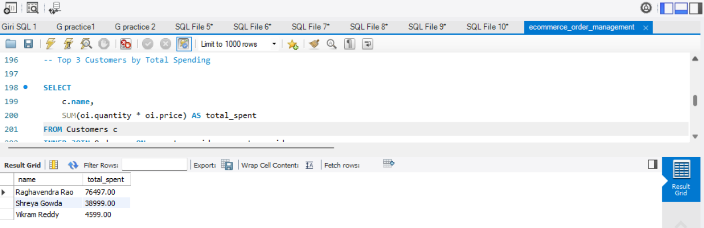
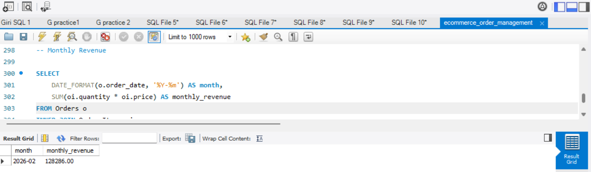
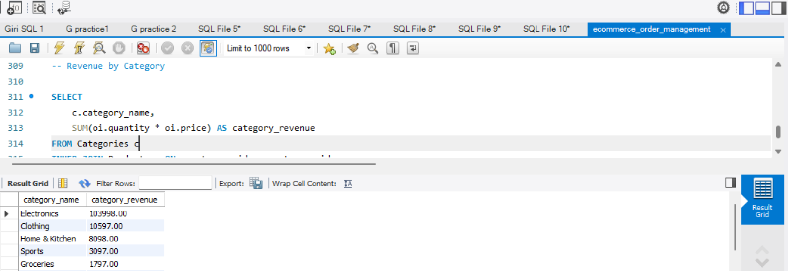

# E-Commerce Order Management System (SQL Project)

## Project Overview

This project simulates a real-world e-commerce database system.  
It demonstrates relational database design, multi-table joins, revenue analytics, and business-focused SQL queries.

The system manages:

- Customers  
- Categories  
- Products  
- Orders  
- Order Items  
- Payments  

---

## Objectives

- Design a normalized relational database schema
- Implement Primary and Foreign Key relationships
- Perform multi-table JOIN operations
- Use GROUP BY, HAVING, and Subqueries
- Generate business insights using SQL analytics

---

## Database Schema

The project includes the following tables:

- `Customers`
- `Categories`
- `Products`
- `Orders`
- `Order_Items`
- `Payments`

Relationships:
- One Customer → Many Orders
- One Order → Many Order Items
- One Product → One Category
- One Order → One Payment

---

## Key SQL Concepts Used

- INNER JOIN
- LEFT JOIN
- GROUP BY
- HAVING
- Subqueries
- Aggregations (SUM, COUNT, AVG, MAX)
- ORDER BY & LIMIT
- Date-based grouping (Monthly Revenue)

---

## Business Insights Generated

- Total Revenue
- Revenue per Order
- Revenue by Category
- Monthly Revenue Trend
- Top Customers by Spending
- Top Selling Products
- Customers with No Orders
- Most Used Payment Method

---

## Skills Demonstrated

- Relational Database Design
- Business Analytics using SQL
- Structured Query Writing
- Data Aggregation & Filtering
- Analytical Thinking

---

## Project Status

Completed.

This project is part of a structured AI/ML learning roadmap connecting:
SQL → Data Analysis → Machine Learning.

---

## Sample Output

### Top 3 Customers by Spending

### Monthly Revenue Trend

### Revenue by Category

